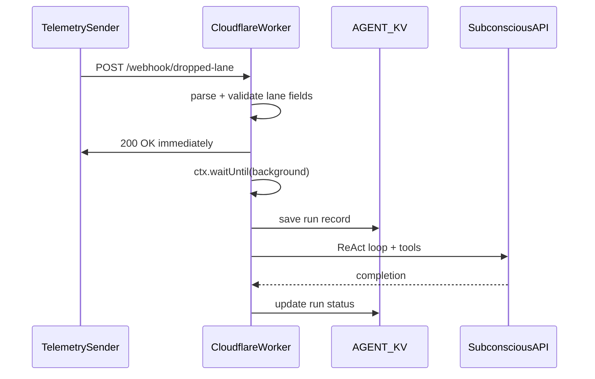
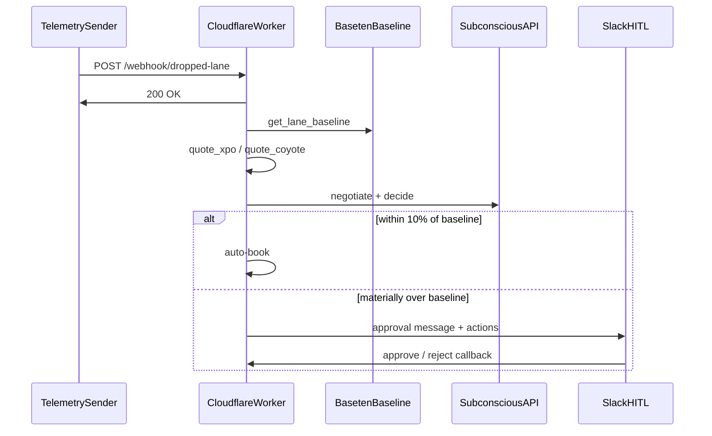

# Freight negotiator — integration reference

Technical reference for coding agents wiring **Baseten**, **mock 3PLs**, **Slack HITL**, and **Subconscious tools** into this Worker. For status and priorities, see [ROADMAP.md](./ROADMAP.md).

---

## 1. System overview

### Sponsor split

| Sponsor | Role in this project |
|---------|---------------------|
| **Cloudflare Workers** | Webhook trigger, orchestration, mock 3PL execution, Slack callback route, demo logs |
| **Baseten** | Fair-market lane baseline (deployed model or sprint mock) |
| **Subconscious** | Negotiator brain — compare quotes, counter-offers, book vs escalate |
| **Slack** | Human-in-the-loop approve/reject (not a dashboard UI) |

### Four-part agent

| Part | Implementation |
|------|----------------|
| **Trigger** | `POST /webhook/dropped-lane`, `/api/run`, `/api/webhook`, cron |
| **Harness** | `src/agent/loop.ts` on the Worker |
| **LLM** | Subconscious via `src/subconscious/client.ts` |
| **Tools** | `src/agent/tools.ts` — Worker executes; not server-side at Subconscious |

### Current flow (implemented)



### Target flow (not yet implemented)



---

## 2. Repository map

| Path | Purpose |
|------|---------|
| [`src/index.ts`](../src/index.ts) | Hono routes — **add new routes before** `app.all("*", ...)` |
| [`src/freight/dropped-lane.ts`](../src/freight/dropped-lane.ts) | Dropped-lane parse, instructions, background processor |
| [`src/agent/tools.ts`](../src/agent/tools.ts) | `TOOL_REGISTRY` — register new freight tools here |
| [`src/agent/store.ts`](../src/agent/store.ts) | `executeAgentRun`, config/runs in KV |
| [`src/agent/loop.ts`](../src/agent/loop.ts) | ReAct loop |
| [`src/types.ts`](../src/types.ts) | `Env`, `AgentConfig`, `AgentRunRecord`, `DEFAULT_AGENT_CONFIG` |
| [`wrangler.toml`](../wrangler.toml) | KV `AGENT_KV`, assets, cron — no extra bindings needed for dropped-lane |

Suggested new modules (not present yet):

- `src/freight/providers/` — shared mock quote logic
- `src/baseten/baseline.ts` — Baseten HTTP client + mock fallback
- `src/slack/notify.ts` — outgoing approval payloads
- `src/slack/verify.ts` — signing secret for interactive callbacks

---

## 3. Environment and secrets

| Variable | Required | Used by | Notes |
|----------|----------|---------|--------|
| `SUBCONSCIOUS_API_KEY` | Yes | Subconscious client | Copy `.dev.vars.example` → `.dev.vars` |
| `WEBHOOK_SECRET` | No | `POST /api/webhook`, `POST /webhook/dropped-lane` | Header `x-webhook-secret` when set |
| `BASETEN_API_KEY` | Future | Baseline tool | Not on `Env` yet |
| `BASETEN_MODEL_ID` | Future | Baseline tool | From Baseten dashboard after `truss push` |
| `SLACK_*` | Future | HITL | Commented in `.dev.vars.example` only |

**Wrangler bindings:** `AGENT_KV`, `ASSETS` (see `wrangler.toml`).

---

## 4. HTTP API reference

| Method | Path | Sync? | Behavior |
|--------|------|-------|----------|
| GET | `/api/health` | Yes | `{ ok: true, service: "hack-agent-starter" }` |
| GET | `/api/agent/config` | Yes | Current `AgentConfig` from KV |
| PUT | `/api/agent/config` | Yes | Merge partial config |
| GET | `/api/agent/tools` | Yes | Tool names + JSON schemas |
| GET | `/api/runs` | Yes | Recent runs |
| GET | `/api/runs/:id` | Yes | Single run |
| POST | `/api/run` | Yes | Run agent now; body `{ instructions?, trigger? }` |
| POST | `/api/webhook` | Yes | Generic event webhook; runs agent before response |
| POST | `/webhook/dropped-lane` | **Ack async** | See below |
| * | `/*` (assets) | Yes | Static `public/` — must stay last |

Cron: `[triggers].crons` in `wrangler.toml`; handler in `export default.scheduled`.

---

### `POST /webhook/dropped-lane` (implemented)

**Auth:** If `WEBHOOK_SECRET` is set on `Env`, require header `x-webhook-secret` matching the secret (same as `/api/webhook`).

**Request body (JSON):**

| Field | Required | Type |
|-------|----------|------|
| `lane_id` | Yes | non-empty string |
| `origin_zip` | Yes | non-empty string |
| `dest_zip` | Yes | non-empty string |
| `supplier` | No | string |
| `fulfillment_center` | No | string |
| `weight_lbs` | No | number |
| `delivery_deadline` | No | string (ISO-8601 recommended) |
| *other* | No | passthrough on payload object |

**Success (200)** — returned **before** the agent finishes:

```json
{
  "ok": true,
  "status": "processing",
  "lane_id": "NC-SUPPLIER-NJ-FC-001",
  "origin_zip": "27513",
  "dest_zip": "07001"
}
```

**Validation error (400):**

```json
{ "error": "lane_id is required and must be a non-empty string" }
```

No background run is started on 400.

**Unauthorized (401):** Missing/wrong `x-webhook-secret` when secret configured.

**Background:** `c.executionCtx.waitUntil(processDroppedLane(env, data))` → `executeAgentRun(env, "dropped-lane", instructions)`.

---

## 5. Dropped-lane module API

Exports from [`src/freight/dropped-lane.ts`](../src/freight/dropped-lane.ts):

### `DroppedLanePayload`

```ts
interface DroppedLanePayload {
  lane_id: string;
  origin_zip: string;
  dest_zip: string;
  supplier?: string;
  fulfillment_center?: string;
  weight_lbs?: number;
  delivery_deadline?: string;
  [key: string]: unknown;
}
```

### `parseDroppedLanePayload(body: unknown)`

Returns `{ ok: true, data }` or `{ ok: false, error: string }`.

### `buildDroppedLaneInstructions(data: DroppedLanePayload)`

Single user message for the agent describing the lane recovery workflow (baseline → 3PL quotes → compare → 10% auto-book / ~20% escalate).

### `processDroppedLane(env: Env, data: DroppedLanePayload)`

Logs start/completion, calls `executeAgentRun(env, "dropped-lane", instructions)`. Intended to run only inside `waitUntil`.

---

## 6. Demo logging convention

| Step | Log prefix / message |
|------|----------------------|
| Request in | `=== [DROPPED-LANE] Webhook received ===` |
| Auth | `[DROPPED-LANE] Webhook auth passed` / `failed` |
| Parsed fields | `[DROPPED-LANE] Parsed lane:` |
| Immediate ack | `[DROPPED-LANE] Returning 200 OK to sender (non-blocking)` |
| Background start | `[DROPPED-LANE] Starting Subconscious agent run for lane:` |
| Run completion | `[DROPPED-LANE] Agent run <id> completed` / `failed` |
| Background error | `[DROPPED-LANE] Background agent run failed:` |

**Recommended for upcoming work:** `[BASETEN]`, `[3PL]`, `[SLACK]`, `[BOOKING]`.

---

## 7. Subconscious integration

- **Base URL:** `https://api.subconscious.dev/v1`
- **Model:** `subconscious/tim-qwen3.6-27b` (`SUBCONSCIOUS_MODEL` in client)
- **Client:** `createSubconscious(apiKey)` — OpenAI-compatible **chat completions**, not `/v1/responses`
- **Thinking:** Defaults **on** via `chat_template_kwargs.enable_thinking` in custom `fetch`
- **Tools:** Defined in `TOOL_REGISTRY`; loop calls `executeTool` in the Worker when the model requests a tool

### Adding a tool

1. Add entry to `TOOL_REGISTRY` in `src/agent/tools.ts` (`name`, `description`, `parameters`, `execute`).
2. Add tool name to `enabledTools` in `DEFAULT_AGENT_CONFIG` or via `PUT /api/agent/config`.
3. Mention the tool in `systemPrompt` / freight instructions so the model knows when to call it.

Full API patterns: [`.agents/skills/subconscious-dev/SKILL.md`](../.agents/skills/subconscious-dev/SKILL.md).

---

## 8. Integration stubs (next agent tasks)

### Mock 3PL quotes

Implement as **agent tools** (not separate public routes unless needed for realism):

- Suggested names: `quote_xpo`, `quote_coyote`
- Return shape: `{ carrier: "XPO" | "Coyote", rate_usd: number, transit_hours: number }`
- Deterministic mocks from `origin_zip` + `dest_zip` (and optionally `weight_lbs`) so demos are repeatable
- Log with `[3PL]` prefix

### Baseten baseline

- Tool name suggestion: `get_lane_baseline`
- Inputs: `origin_zip`, `dest_zip`, optional `weight_lbs`
- Call OpenAI-compatible Baseten endpoint when `BASETEN_API_KEY` + model ID present; else return a fixed mock USD rate with `[BASETEN] mock` log
- Deploy config: [`qwen-3-4b-instruct-2507/config.yaml`](../qwen-3-4b-instruct-2507/config.yaml)

### Slack HITL

**Outgoing (approval):** POST to Slack incoming webhook URL with Block Kit or legacy attachments:

- Required fields per [AGENTS.md](../AGENTS.md): lane, carrier, quote, baseline, % over baseline, delivery guarantee, one-sentence rationale, approve/reject actions

**Incoming (callback):** New route e.g. `POST /webhook/slack/actions`:

- Verify `SLACK_SIGNING_SECRET`
- Parse interactive payload; map `approve` / `reject` to booking finalize or cancel
- Log with `[SLACK]`

### Booking policy

- **Auto-book:** negotiated rate ≤ **10%** over baseline
- **Escalate:** best viable rate materially over baseline (~**20%+**)
- Prefer explicit tool `request_slack_approval` plus a post-agent guardrail so the model cannot bypass HITL

---

## 9. Local dev and verification

```bash
npm install
cp .dev.vars.example .dev.vars   # set SUBCONSCIOUS_API_KEY
npm run dev                      # http://localhost:8787
```

**Dropped-lane positive test:**

```bash
curl -s -X POST http://localhost:8787/webhook/dropped-lane \
  -H "Content-Type: application/json" \
  -d '{
    "lane_id": "NC-SUPPLIER-NJ-FC-001",
    "origin_zip": "27513",
    "dest_zip": "07001",
    "supplier": "NC Furniture Co",
    "fulfillment_center": "NJ-FC-12",
    "weight_lbs": 4200,
    "delivery_deadline": "2026-05-28T18:00:00Z"
  }'
```

**Negative test:**

```bash
curl -s -X POST http://localhost:8787/webhook/dropped-lane \
  -H "Content-Type: application/json" \
  -d '{"origin_zip": "27513", "dest_zip": "07001"}'
```

**Inspect runs:**

```bash
curl -s http://localhost:8787/api/runs
```

**Cron (local):**

```bash
curl "http://localhost:8787/cdn-cgi/handler/scheduled"
```

---

## 10. Related docs

- [README.md](../README.md) — hackathon narrative and getting started
- [AGENTS.md](../AGENTS.md) — agent-oriented project guide
- [ROADMAP.md](./ROADMAP.md) — done vs remaining work
