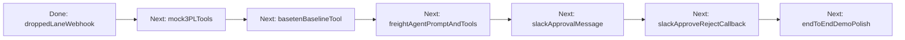

# Freight negotiator roadmap

## Product goal

Build the **Freight Rate Spot Market Negotiator** for Wayfair supplier and procurement operations: when a primary carrier drops a lane (e.g. North Carolina supplier → New Jersey fulfillment center), a Cloudflare Worker recovers capacity in seconds—baseline pricing, mock 3PL quotes, Subconscious-driven negotiation, auto-book within policy, or **Slack** human approval for material over-baseline spend. The demo surface is **Slack + Wrangler logs**, not a standalone dashboard.

See also: [AGENTS.md](../AGENTS.md), [INTEGRATION.md](./INTEGRATION.md).

---

## Status summary

| Phase | Status | Notes |
|-------|--------|--------|
| Worker + Subconscious ReAct stack | **Done** | Loop, runner, KV store, client |
| Starter agent tools | **Done** | `get_time`, `log_note`, `search_catalog`, `fetch_url` |
| Generic API + webhook | **Done** | `/api/*`, `POST /api/webhook` |
| Dropped-lane telemetry trigger | **Done** | `POST /webhook/dropped-lane`, `waitUntil`, demo logs |
| Mock 3PL environment | **Done** | Local Express server for XPO/Coyote exists and `fetch_quotes` calls both providers |
| Baseten baseline tool | **Not started** | Config exists; not wired to agent |
| Freight agent prompt + tool enablement | **Done** | Default config uses freight negotiator prompt with `fetch_quotes` and `request_human_approval` |
| Slack HITL message | **Partial** | `request_human_approval` sends or prints Block Kit payload; callbacks still pending |
| Slack approve/reject callback | **Not started** | — |
| End-to-end demo polish | **Not started** | 60s recording script |

---

## Completed work

### Core platform

- **Harness:** [`src/agent/loop.ts`](../src/agent/loop.ts) — ReAct loop with client-side tool execution
- **Tools:** [`src/agent/tools.ts`](../src/agent/tools.ts) — `TOOL_REGISTRY`, starter tools
- **Store / runner:** [`src/agent/store.ts`](../src/agent/store.ts), [`src/agent/runner.ts`](../src/agent/runner.ts)
- **Subconscious client:** [`src/subconscious/client.ts`](../src/subconscious/client.ts) — `subconscious/tim-qwen3.6-27b`, thinking on by default
- **Routes:** [`src/index.ts`](../src/index.ts) — health, config, runs, `/api/run`, `/api/webhook`, static assets catch-all last

### Dropped-lane trigger (slice 1)

- [`src/freight/dropped-lane.ts`](../src/freight/dropped-lane.ts) — `parseDroppedLanePayload`, `buildDroppedLaneInstructions`, `processDroppedLane`
- `POST /webhook/dropped-lane` — validate JSON, optional `WEBHOOK_SECRET`, **200 immediately**, `ctx.waitUntil(processDroppedLane)`
- `trigger: "dropped-lane"` on [`AgentRunRecord`](../src/types.ts) for `/api/runs` history
- Grep-friendly logs: `[DROPPED-LANE]` prefix throughout

### Baseten (deploy config only)

- [`qwen-3-4b-instruct-2507/config.yaml`](../qwen-3-4b-instruct-2507/config.yaml) — Truss/TRT-LLM target for fair-market baseline; **not** called from the Worker yet

### Slack (placeholders only)

- Commented `SLACK_*` keys in [`.dev.vars.example`](../.dev.vars.example); not on `Env` type yet

---

## Remaining work (demo order)



| Priority | Item | Target files | Acceptance criteria |
|----------|------|--------------|---------------------|
| **P1** | Mock 3PL quote tools (XPO, Coyote) | `scripts/mock-3pl-server.mjs`, `src/agent/tools.ts`, `scripts/run-freight-agent.mjs` | Local Express endpoints return `{ carrier, quote_price, estimated_transit_hours }`; `fetch_quotes` calls both endpoints |
| **P2** | Baseten baseline tool | `src/agent/tools.ts`, optional `src/baseten/baseline.ts` | Fair-market USD baseline; real Baseten if `BASETEN_API_KEY` + model ID set, else sprint-safe mock |
| **P3** | Freight agent config | `src/types.ts` `DEFAULT_AGENT_CONFIG`, `src/agent/prompt.ts` | Enable freight tools; system prompt targets cheapest alternative rate under `$1500` |
| **P4** | Slack operator message | `src/agent/tools.ts`, `scripts/run-freight-agent.mjs` | Incoming webhook payload: lane, carrier, quote, transit hours, approve/reject URL actions |
| **P5** | Slack approve/reject callback | `src/index.ts` e.g. `POST /webhook/slack/actions` | Verify signing secret; finalize or reject booking; log outcome |
| **P6** | Demo polish | All freight modules | `[DROPPED-LANE]` / `[3PL]` / `[BASETEN]` / `[SLACK]` at every step; 60s recording passes |

---

## Explicit non-goals

- Standalone dashboard UI as the primary demo surface
- Autonomous booking above the HITL threshold (compliance failure)
- Real XPO/Coyote production API integration

---

## Verification checklist

### Dropped-lane (today)

After `npm run dev`:

```bash
# Positive — expect immediate 200 + background agent run
curl -s -X POST http://localhost:8787/webhook/dropped-lane \
  -H "Content-Type: application/json" \
  -d '{
    "lane_id": "NC-SUPPLIER-NJ-FC-001",
    "origin_zip": "27513",
    "dest_zip": "07001",
    "supplier": "NC Furniture Co",
    "fulfillment_center": "NJ-FC-12",
    "weight_lbs": 4200,
    "delivery_deadline": "2026-05-28T18:00:00Z"
  }'

# Negative — omit lane_id → 400, no background run
curl -s -X POST http://localhost:8787/webhook/dropped-lane \
  -H "Content-Type: application/json" \
  -d '{"origin_zip": "27513", "dest_zip": "07001"}'

# Run history
curl -s http://localhost:8787/api/runs | jq '.runs[] | select(.trigger=="dropped-lane")'
```

**Expected:** JSON `200` with `ok: true`, `status: "processing"`; Wrangler terminal shows `[DROPPED-LANE]` then Subconscious activity; `/api/runs` includes `trigger: "dropped-lane"`.

If `WEBHOOK_SECRET` is set in `.dev.vars`, add `-H "x-webhook-secret: <secret>"` to both POSTs.

### Future (when built)

- [x] Local mock 3PL server returns XPO and Coyote spot quotes
- [ ] Agent calls mock 3PL tools and baseline tool in one dropped-lane run
- [ ] Slack message visible with approve/reject actions
- [ ] Approve/reject callback completes or cancels booking with logged outcome
- [ ] Full lane recovery under ~60s on recording with visible log story
